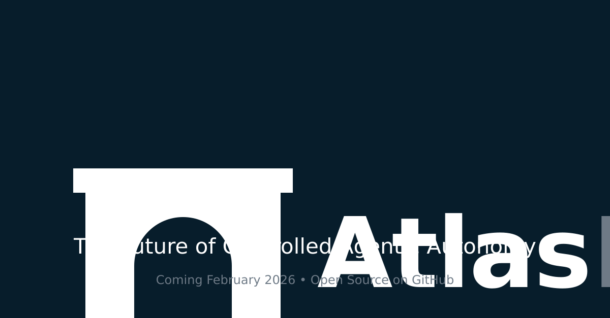

<p align="center">
  
</p>

# AtlasBridge Website

Public website and landing surface for AtlasBridge — a deterministic governance runtime for AI agents.

---

## Overview

This repository contains the source code for the AtlasBridge public-facing website. It serves as the primary marketing, documentation, and information surface for the project.

This repository is **separate from the AtlasBridge core runtime**. It does not execute AI agents, perform runtime governance, or enforce policies. All governance enforcement logic resides in the core runtime repository.

What this repository includes:

- Landing page and product positioning
- Public documentation viewer
- Dashboard and policy management interface (authenticated)
- Brand assets and social media collateral

---

## Tech Stack

| Layer | Technology |
| --- | --- |
| Frontend | React 19, TypeScript 5.6 (strict mode) |
| Styling | Tailwind CSS 4, Shadcn UI |
| Routing | wouter |
| State | TanStack React Query |
| Backend | Express 5, TypeScript |
| Database | PostgreSQL, Drizzle ORM |
| Build | Vite 7 (client), esbuild (server) |
| Testing | Vitest, Playwright, axe-core |
| Linting | ESLint 9, Prettier |
| CI/CD | GitHub Actions |

---

## Local Development Setup

### Prerequisites

- Node.js 22+
- npm 10+
- PostgreSQL (required for backend features; the landing page renders without it)

### Install Dependencies

```bash
npm install
```

### Run Development Server

```bash
npm run dev
```

The development server starts on **http://localhost:3000** by default. Set the `PORT` environment variable to override.

To run the Vite client independently (port 5000):

```bash
npm run dev:client
```

### Available Scripts

| Script | Description |
| --- | --- |
| `npm run dev` | Start full-stack development server |
| `npm run dev:client` | Start Vite client only (port 5000) |
| `npm run build` | Build production artifacts |
| `npm run start` | Start production server |
| `npm run check` | TypeScript type checking |
| `npm run lint` | Run ESLint |
| `npm run format:check` | Check Prettier formatting |
| `npm run format` | Auto-fix formatting |
| `npm test` | Run unit and integration tests |
| `npm run test:coverage` | Run tests with coverage report |
| `npm run e2e` | Run Playwright E2E tests |

---

## Build for Production

```bash
npm run build
```

This produces two outputs:

- **Client**: Vite compiles the React application to `dist/public/`
- **Server**: esbuild bundles the Express server to `dist/index.cjs`

To start the production server:

```bash
npm run start
```

---

## Testing

### Unit and Integration Tests

Tests are located in `client/src/__tests__/` and use Vitest with React Testing Library.

```bash
npm test              # Single run
npm run test:watch    # Watch mode
npm run test:coverage # With coverage report
```

### End-to-End Tests

E2E tests are located in `e2e/` and use Playwright with Chromium.

```bash
npm run e2e           # Headless (auto-starts dev server)
npm run e2e:ui        # Interactive UI mode
```

E2E tests include accessibility checks via axe-core.

### Linting and Type Checking

```bash
npm run lint          # ESLint
npm run format:check  # Prettier
npm run check         # TypeScript compiler
```

---

## CI/CD Overview

### Continuous Integration

CI runs automatically on **pull requests** and **pushes to main** via GitHub Actions.

Checks performed:

1. Lint (ESLint)
2. Format verification (Prettier)
3. Type checking (TypeScript)
4. Unit and integration tests with coverage
5. Production build verification
6. E2E tests (on push to main)
7. Secret scanning (gitleaks)
8. Dependency audit

All quality checks must pass before a pull request can be merged.

### Continuous Deployment

Deployment runs on **push to main** or **version tags** (`v*`).

Guardrails:

- Deploys only from the upstream repository (not forks)
- Uses GitHub environment protection
- One deployment at a time (concurrency lock)
- Build artifacts are archived for auditability

See [CONTRIBUTING.md](CONTRIBUTING.md) for full details on CI/CD pipelines and branch protection recommendations.

---

## Security and Governance Disclaimer

This repository is a **website and documentation surface**. It does not:

- Execute AI agents
- Perform runtime governance or policy enforcement
- Process production workloads
- Store or transmit governance decisions

AtlasBridge runtime governance is implemented in the core repository, which is separate from this codebase.

Contributors must ensure:

- No sensitive data, secrets, or credentials are committed
- No personally identifiable information appears in test fixtures
- All contributions are suitable for public visibility

---

## Brand and Asset Usage

Brand assets are located in the `brand/` directory, organized by format:

- `brand/svg/` — Vector logos and icons
- `brand/png/` — Raster logos, wordmarks, and icons
- `brand/social/` — Social media assets and avatars
- `brand/favicons/` — Favicon set for web deployment

Usage guidelines:

- Do not modify, stretch, or recolor logo assets
- Use only approved variants from the `brand/` directory
- Maintain clear space around the logo in all applications
- Use the dark variant on light backgrounds and the light variant on dark backgrounds

---

## Contributing

Contributions are welcome. Please read [CONTRIBUTING.md](CONTRIBUTING.md) for detailed guidance.

Summary:

1. Fork the repository
2. Create a feature branch from `main`
3. Make changes with clear, atomic commits
4. Ensure all CI checks pass locally before pushing
5. Open a pull request against `main`

Requirements:

- All CI checks must pass
- No secrets or credentials in commits
- No exaggerated or unsubstantiated claims in content
- Follow the established technical tone and positioning

---

## License

This project is licensed under the MIT License. See `package.json` for the license declaration.
